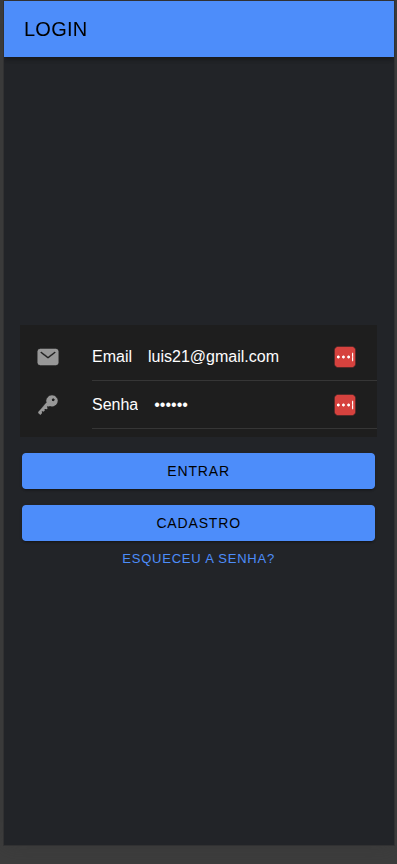
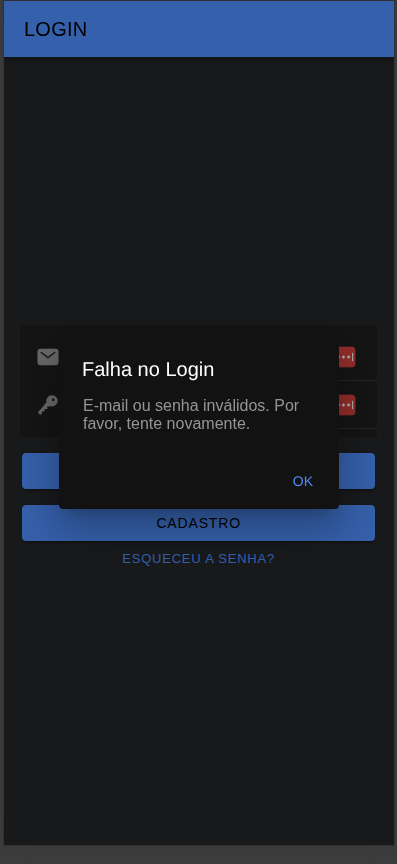
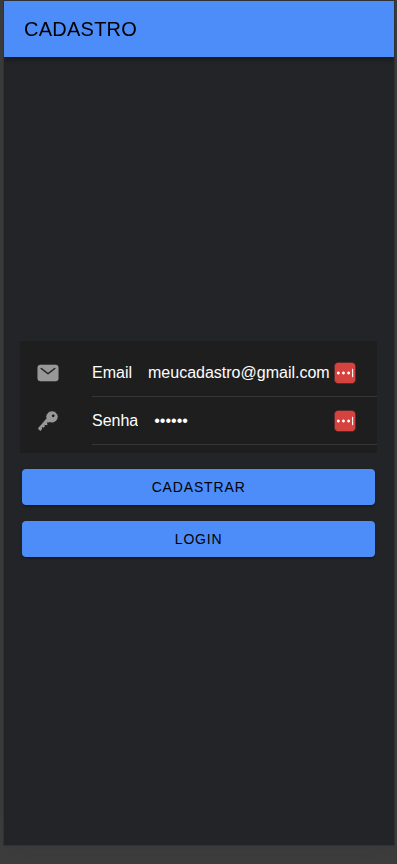
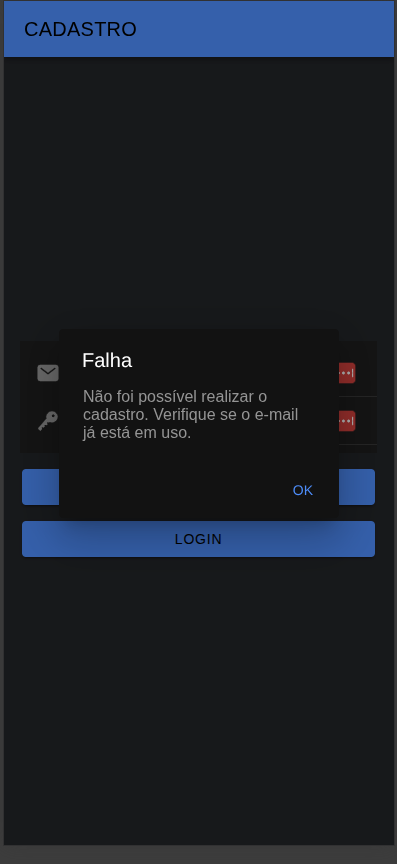
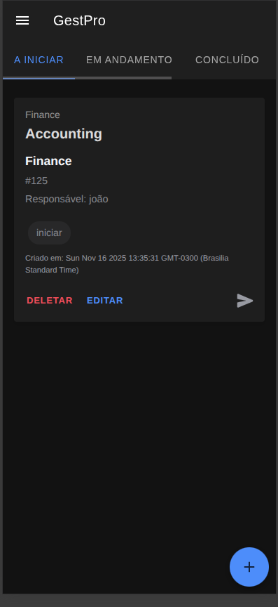
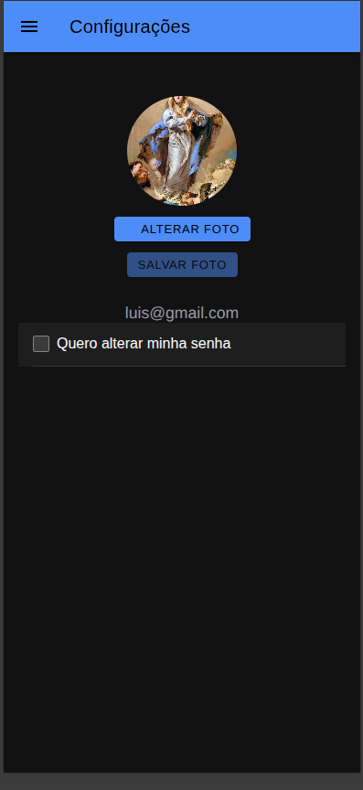
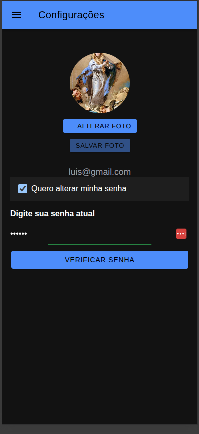
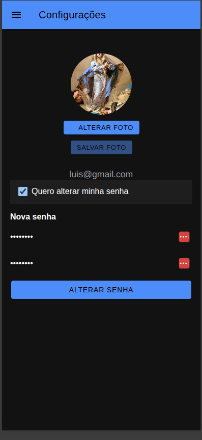

# Gest-Pro

Gest-Pro é um aplicativo de gestão de projetos e tarefas desenvolvido com Angular, Ionic e Firebase. Ele oferece uma experiência moderna, responsiva e multiplataforma para gerenciamento de usuários, projetos, tarefas, configurações e autenticação.

## Índice
- [Gest-Pro](#gest-pro)
  - [Índice](#índice)
  - [Visão Geral](#visão-geral)
  - [Funcionalidades Principais](#funcionalidades-principais)
  - [Screenshots](#screenshots)
    - [Tela de Login](#tela-de-login)
      - [](#)
      - [Falha de Login](#falha-de-login)
    - [Tela de Cadastro](#tela-de-cadastro)
      - [Falha de Cadastro](#falha-de-cadastro)
    - [Tela de Tarefas](#tela-de-tarefas)
    - [Tela de Configurações](#tela-de-configurações)
      - [Change password](#change-password)
  - [Instalação e Configuração](#instalação-e-configuração)
    - [Pré-requisitos](#pré-requisitos)
    - [Passos](#passos)
  - [Estrutura de Pastas](#estrutura-de-pastas)
  - [Tecnologias Utilizadas](#tecnologias-utilizadas)
  - [Segurança](#segurança)
  - [Contribuição](#contribuição)
  - [Licença](#licença)

---

## Visão Geral

O Gest-Pro foi criado para facilitar o controle de projetos, tarefas e equipes, permitindo que usuários gerenciem suas atividades de forma eficiente e segura. O app utiliza autenticação via Firebase, armazenamento de arquivos (fotos de perfil), e regras de segurança para proteger os dados dos usuários.

## Funcionalidades Principais

- **Autenticação de Usuário**
    - Cadastro, login, logout e recuperação de senha
    - Reautenticação para operações sensíveis (ex: alteração de senha)
- **Gestão de Perfil**
    - Visualização e edição de dados do usuário
    - Upload e alteração de foto de perfil
    - Alteração de senha com verificação da senha atual
- **Gestão de Projetos**
    - Criação, edição e exclusão de projetos
    - Visualização de detalhes do projeto
- **Gestão de Tarefas**
    - Criação, edição, exclusão e conclusão de tarefas
    - Associação de tarefas a projetos
    - Acompanhamento de status
- **Configurações**
    - Alteração de preferências do usuário
    - Gerenciamento de notificações
- **Interface Responsiva**
    - Layout adaptado para dispositivos móveis e desktop
- **Menu Lateral (Drawer)**
    - Navegação rápida entre as principais telas do app

## Screenshots

> **Adicione imagens de cada tela do app nas seções abaixo.**

### Tela de Login

####


#### Falha de Login


### Tela de Cadastro


#### Falha de Cadastro


### Tela de Tarefas


### Tela de Configurações


#### Change password



> Para adicionar imagens, salve os arquivos PNG/JPG na pasta `docs/screens/` e atualize os caminhos acima.

## Instalação e Configuração

### Pré-requisitos
- Node.js >= 18
- npm >= 9
- Angular CLI

### Passos
1. Clone o repositório:
     ```bash
     git clone https://github.com/YabotzNorriz/gest-pro.git
     cd gest-pro
     ```
2. Instale as dependências:
     ```bash
     npm install
     ```
3. Configure o Firebase:
     - Crie um projeto no [Firebase Console](https://console.firebase.google.com/)
     - Ative Authentication (Email/Senha)
     - Ative Firestore Database e Storage
     - Copie as credenciais do Firebase para os arquivos `src/environments/environment.ts` e `src/environments/environment.prod.ts`
4. Execute o app em modo desenvolvimento:
     ```bash
     npm start
     ```
5. Para build de produção:
     ```bash
     npm run build
     ```

## Estrutura de Pastas

```
├── src/
│   ├── app/
│   │   ├── configuracao/           # Tela de configurações
│   │   ├── services/               # Serviços (UserService, Auth, etc)
│   │   ├── models/                 # Modelos de dados (UserData, Projeto, Tarefa)
│   │   ├── assets/                 # Imagens e arquivos estáticos
│   │   └── ...
│   ├── environments/               # Configurações de ambiente
│   ├── theme/                      # Temas e estilos globais
│   └── ...
├── docs/screens/                   # Imagens das telas para README
└── ...
```

## Tecnologias Utilizadas
- [Angular](https://angular.io/) 20+
- [Ionic Framework](https://ionicframework.com/)
- [Firebase (Auth, Firestore, Storage)](https://firebase.google.com/)
- [Capacitor](https://capacitorjs.com/) (para build mobile)
- [TypeScript](https://www.typescriptlang.org/)
- [SCSS](https://sass-lang.com/)

## Segurança
- Todas as operações sensíveis (upload de foto, alteração de senha) exigem autenticação.
- As regras do Firebase Storage e Firestore garantem que cada usuário só acesse seus próprios dados.
- As senhas nunca são armazenadas no frontend, apenas enviadas via HTTPS para o Firebase Auth.
- O app não armazena dados sensíveis no navegador.

## Contribuição
1. Faça um fork do projeto
2. Crie uma branch: `git checkout -b minha-feature`
3. Faça suas alterações e commit: `git commit -m 'Minha feature'`
4. Envie para o seu fork: `git push origin minha-feature`
5. Abra um Pull Request

## Licença
Este projeto está licenciado sob a licença MIT.

---

**Gest-Pro** — Gestão de projetos e tarefas de forma simples, segura e moderna.
